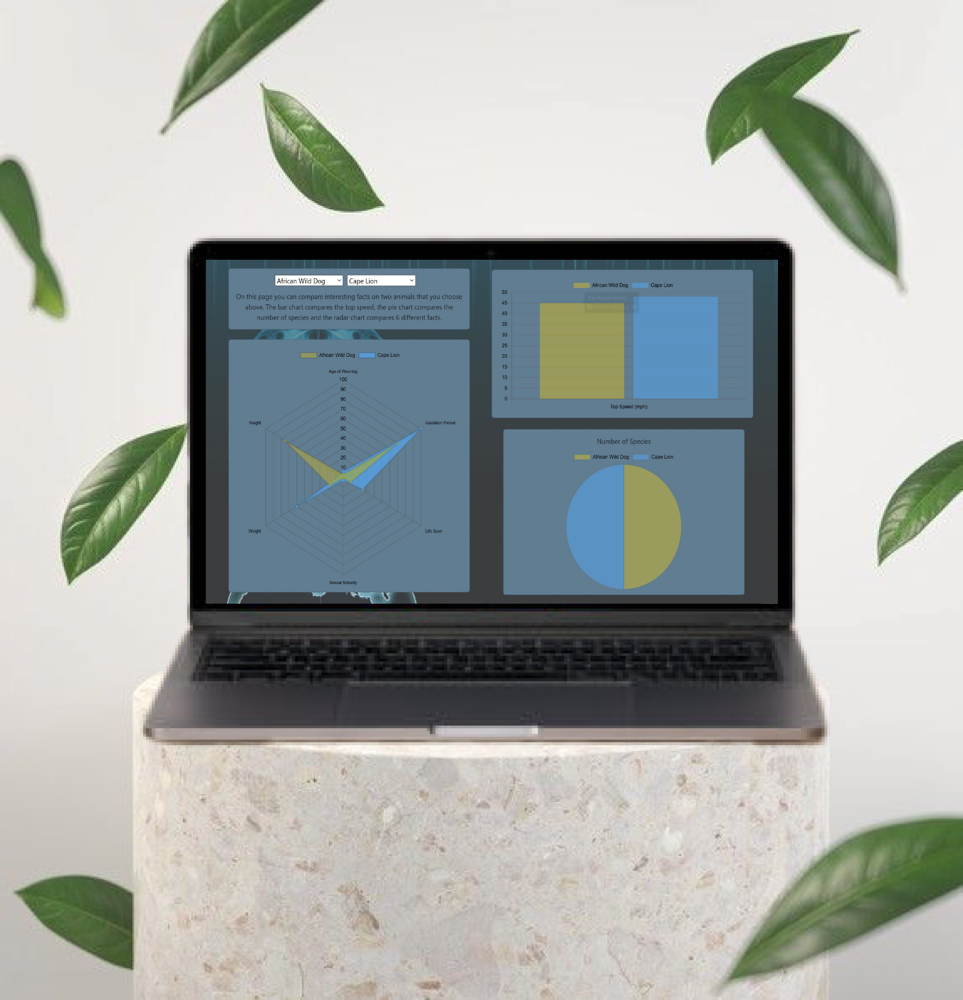
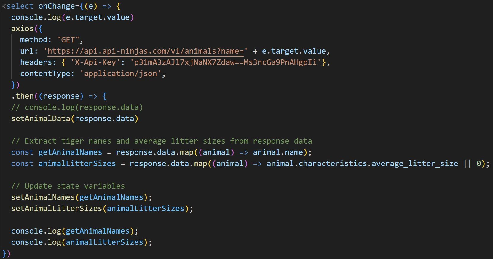

  

<h3 align="center">Wild Animals</h3>
<h4 align="center">This is a website application for a animal API.</h4.>

<h5 align="center" style="padding:0;margin:0;">Mariné du Plessis</h5>

    
    ·
    <a href="https://github.com/DupieM/DuPlessisMarine_221326_Final_Project/issues">Report Bug</a>
    ·
    <a href="https://github.com/DupieM/DuPlessisMarine_221326_Final_Project/issues">Request Feature</a>

## Table of Contents

- [Product Mockup](#product-mockup)
- [About the Project](#about-the-project)
    - [Project Description](#project-description)
    - [Built With](#built-with)
- [Getting Started](#getting-started)
    - [Prerequisites](#prerequisites)
    - [How to install](#how-to-install)
- [Features and Functionality](#features-and-functionality)
- [Concept Process](#concept-process)
    - [Ideation](#ideation)
    - [Wireframes](#wireframes)
- [Development Process](#development-process)

    - [Implementation Process](#implementation-process)
        - [Highlights](#highlights)
        - [Challenges](#challenges)
    - [Future Implementation](#peer-reviews)
- [Final Outcome](#final-outcome)
    - [Mockups](#mockups)
    - [Video Demonstration](#video-demonstration)
- [Conclusion](#conclusion)

# Product Mockup

# About the Project
## Project Description
I took on the role of a data driven devoloper, being tasked with implementing a real world data driven web application. 
I could use an API of my choice for the data that had to be collected. 
I needed to focus this term on research, analysis,implementation and visualisation of the API of my choice. 
The project needed to use charts.js to display the data on different charts and it also needed to use React to create the framework of the front end of the website.

## Built with
* 
* 
* 
* 

# Getting Started
## Prerequisites
You will need to have the react app dowloaded on your device.
You will also need visual studio code to can use the react app function.

## How to install
Clone the project repository as follow:

1.  GitHub Desktop  
    Enter `https://github.com/DupieM/final_project.git` into the URL field and press the `Clone` button.

To create the React app do the following steps:

1.  Go to Visual Studio code   
    Open your Visual Studio code then click on File and then click on open folder
    Then navigate to where you created your folder and open it

2.  Start terminal  
    Go to 'Terminal' then click on new terminal.
    After that then Go back to 'Terminal' and then click on 'split terminal'.

3.  Start React  
    On one side of the terminal type 'npm start2' to navigate into that file.
    After that type 'npm start' to start the react app

# Features and Functionality
## Landing Dashboard
I needed to display a summary or breakdown of the chosen dataset. I also should display information like key factors of the research or the chosen dataset. On the dashboard page the user can find more information about the website and the API that is used. The data set is outlined as to explain the type of data that will be used for this web application. On this page there is a carousel that displays a distinct animal visually with some interesting facts. There are also two charts on the page, one chart shows the average litter size of panda species and anoder chart that shows number of species for crocodiles.

## Comparison Page
I needed to display three charts on this page, where data could be changed by a selection from a dropdown box. The three charts are a Pie, Bar and Radar chart. Based on the selection made three charts will be displayed as to compare two animals with. The Pie chart shows the number of species for the chosen animals. The Bar chart shows the top speed of the two animals chosen. The Radar chart shows the age of weaning, gestation period, life span, sexual maturity, height and weight of the chosen animals. 

## Timeline Page
I needed to display a timeline chart on this page where the data could be changed by a dropdown box. The timeline page shows the average litter size of the chosen animal on a timeline chart. Five different animals can be chosen. 

# Devolopment Process
## Custom UI
My custom UI element was that I created an interesting background picture to use on my website for the three pages we needed to create. I also included as a UI element a carousel that displays one exstict animal visually and with interesting facts. I also created a custom logo for this website.

## Implementation Process
The higlight was in researching API's and decinding on which API's to use. Analysing the dataset of my chosen API was also a higlight for me during the development process.
Some challeges that I faced while doing this project was to display my different characteristics of animals on the 4 charts we needed to have. Another challange was to activate the dropdown box on the compare and timeline page depending on which ever animal you choose.

### Code Snippets
1. Dropdown box on the compare and timeline page

To fix the problem with the dropdown box to display different animals I decided to add the "onChange" function to the dropdown box.
This helped me alot by changing the name at end of Api key to be able to get difffernt animal statistics.

# Future Implementation
The current web application developed visualize a animal data set but only specific data elemnts from that data set. For future implementations more data elements can be added to show more meaningful patterns as derived from the data.

# Final Outcome 
## Video Demonstration
Please use this link to view my demonstartion walkthrough video of my final webasite application.
<!-- Link -->
[View Demonstration]()

# Conclusion
### License
Rights reserved © 2023

### Author
**Mariné du Plessis**  
[Gmail](mdp.marine@gmail.com)
